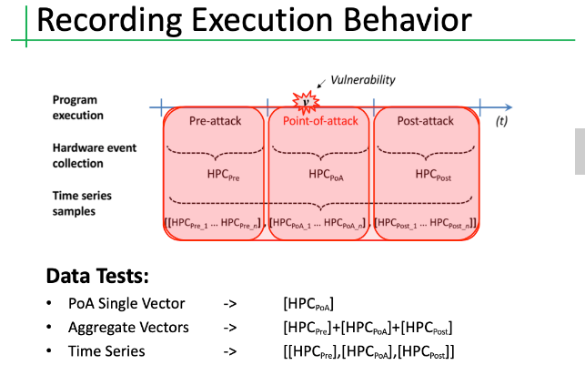

# non-controlflow-hijacking-datasets


## Introduction
The aim of this readme file is introducing a dataset for utilizing low-level hardware information to detect Non-Control-Flow hijacking attacks. 

Multiple traditional techniques have been proposed to defend computing systems against malware attacks that hijack the control-flow of the victim program (control-oriented attacks). However, non-control-flow hijacking attacks are created in such a way that makes them more difficult to be detected hence prevented with traditional mitigation techniques that target control-oriented attacks. We successfully designed a methodology for the detection of non-control-flow hijacking attacks via employing low-level hardware information formatted as time series. Using architectural and micro-architectural hardware event counts, we model the regular execution behavior of the application(s) of interest, in an effort to detect abnormal execution behavior taking place in the vicinity of the vulnerability. And we organized the experiments recordings as a dataset here in order to encourage the other researchers to push the STA of detection performance. The benefit of this dataset for other ML (machine learning) researchers is that it eliminates the necessity for ML experterts to learn about the domain-specific knowledge of the malware.

We hope this dataset can bridge the discrepancy between the security community and the machine learning community for improving the detection performance of Non-Control-Flow Hijacking Attacks.

## Exploits
These are the list of the exploits we use in the data set.

| Vulnerability | Type | Program | Exploit | Type |
| ------------- | ---- | ------- | ------- | ---- |
| bugtraq ID: 41956 | Format String | orzHTTPd | orzhttpd_rootdir <br> orzhttpd_leakaddr | Data leak <br> Mem leak |
| CVE-2013-2028 | Stack Buffer Overflow | nginx | nginx_rootdir <br> nginx_keyleak | Data leak <br> Data leak |
| CVE-2014-3566 | Encryption Downgrade | OpenSSL | POODLE | Data leak |
| CVE-2015-0204 | Encryption Downgrade | OpenSSL | FREAK | Data leak |
| CVE-2015-0400 | Encryption Downgrade | OpenSSL | Logjam | Data leak |

These exploits are non-control-flow hijacking attacks where the attacker preserves the control flow of the benign program. The non-control-flow hijacking attacks shown to have a high degree of overlap between regular and malicious behavior since the non-control-flow hijacking attacks only manipulate the inputs of the program and conserve the regular program’s control flow making it difficult to differentiate between regular and malicious samples but at the same time, it is significantly more difficult to duplicate and deploy.

## Hardware Events
The following table contains the hardware events used in this data set.

#### Architectural Events
| Event Name | Event Description |
| ---------- | ----------------- |
| LOAD | Load instructions retired |
| STORE | Store instructions retired |
| CALL_D | Direct near call instructions retired |
| CALL_ID | Indirect near call instructions retired |
| RET | Near return instructions retired |

#### Micro-architectural Events
| Event Name | Event Description |
| ---------- | ----------------- |
| MISP_BR | Mis-predicted branch instructions |
| MISP_BR_C | Mis-predicted conditional branches |
| MISS_ITLB | I-TLB misses |
| MISS_DTLB | D-TLB-misses |
| STLB_HIT | Shared TLB hits after I-TLB misses |
| MISS_ICACHE | I-Cache misses |
| MISS_LLC | Last Level Cache misses |

These hardware events can be separated into two types architectural and micro-architectural events. The architectural events are consider to be stable and deterministic as they only characterize the instruction mix of the running program. The micro-architectural events are considered to be non-deterministic due to their dependency on the state of the hardware resources at the time of the execution, which can vary between executions of the same program.

## Timesteps
In this data set, we collect the hardware event as context at the function call level. We consider the contexts during the execution of the program as pre-attack, point-of-attack, and post-attack. As their name suggested, they account for the execution before, during, and after the attack occurs. Both benign and malicious data samples corresponding to the execution context where the vulnerability resides in the program.



Sv folder contains **Single Point-of-attack Vector** HPC data samples. Each sample consists of hardware event counts from the point-of-attack (PoA) context.

Ag folder contains **Aggregate Vector** HPC data samples. Each sample consists of the aggregated hardware event counts from across all the execution contexts.

Ts folder contains **Time Series** HPC data samples. Each sample consists of the aggregated hardware event counts from across all the execution contexts formatted as a time series.


## Data sample
The data is provided in CSV format. Each row represents one benign/malicious data record for the program. In the column field, type 1 and -1 represent benign and malicious data. The rest of the column fields are corresponding to the hardware events shown in the hardware events table.

## Datasets
There are 21 diffrent datasets dividing into 3 main categories, namely, the *point-of-attack*, *aggregate*, and *time-series* methodology of collecting each exploit. Within in each collection methodology there are five subsets for each exploit (*freak*, *logjam*, *nginx_keyleak*, *nginx_rootdir*, *orzhttpd_restore*, *orzhttpd_rootdir*, *poodle*) consisting of a training set containing only benign behaviour and a testing set containing an even amount of benign and malicious behaviour.

### Example Pseudocode
Here is an example of performing 5-fold cross validation across the different subsets using some Python pseudocode.
```python
for exploit in exploits:
  for i in range(5)
    X_train, Y_train = load_csv('{}/{}/subset_{}/train_set.csv'.format(version, exploit, i)
  
  
    model.train(X_train, Y_train)

    for j in range(5):
      X_test, Y_test = load_csv('{}/{}/subset_{}/test_set.csv'.format(version, exploit, j)
      
      results = model.test(X_test, Y_test)
```

## Citation
If you are interested in utilizing this dataset for your research. Please cite following paper:

	@inproceedings{torres2019detecting,
	 title={Detecting Non-Control-Flow Hijacking Attacks Using Contextual Execution Information},
	 author={Torres, Gildo and Yang, Zhiliu and Blasingame, Zander and Bruska, James and Liu, Chen},
	 booktitle={Proceedings of the 8th International Workshop on Hardware and Architectural Support for Security and Privacy},
	 pages={1--8},
	 year={2019}
	}


